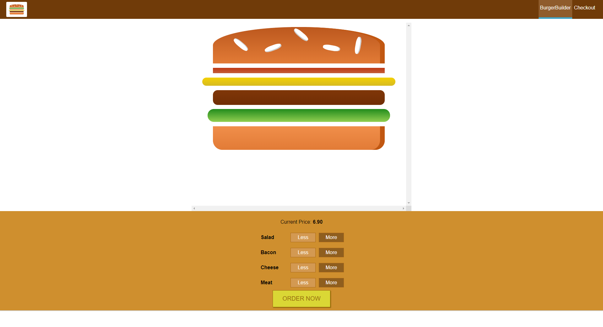

# Burger Builder (React Project)




## Quickstart

1. Install the [node.js](https://nodejs.org/en/)
2. Clone the project

    ```bash
    git clone https://github.com/ayatoullah/burger-builder.git
    ```

3. Go to project folder and run

    ```bash
    npm install
    ```

4. Start development mode

    ```bash
    npm run start
    ```

5. In browser open page with address [http://localhost:3000/](http://localhost:3000/)

### Main tasks

- npm run start -  launches watchers and server & compile project.
- npm run build - optimize & minify files for production version.
- npm run test - for testing version.


## FILES INCLUDED :

- HTML Files.
- CSS Files.
- JS Files.

## Main-Credits

- React 
- jest

## Support:

- If you need any help using the file or need special customizing please contact me via my Github or my Website.
- please follwo me , We’ll appreciate it very much Thank you.
